##  Using AngularJS in Eclipse, Part 2) Add Some Control 

This is the second of four posts on how to run (inside Eclipse) the examples provided in [AngularJS](http://angularjs.org/http://angularjs.org/)'s home page:  

* [Using AngularJS in Eclipse, Part 1) The Basics](/manuscript/C1_Using_AngularJS-usingangularjsineclipsepart1thebasics.md)
* Using AngularJS in Eclipse, Part 2) Add Some Control
* [Using AngularJS in Eclipse, Part 3) Wire up a Backend](/manuscript/C1_Using_AngularJS-usingangularjsineclipsepart3wireupabackend.md)
* [Using AngularJS in Eclipse, Part 4) Create Components](/manuscript/C1_Using_AngularJS-usingangularjsineclipsepart4createcomponents.md)

The example covered on this post is the _Add Some Control:_

[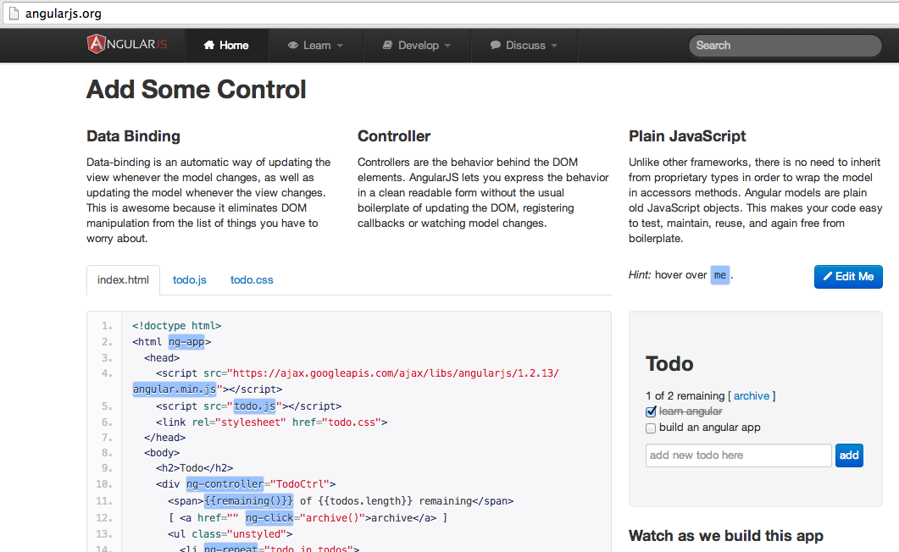](http://4.bp.blogspot.com/-Ggx-jfNLqzA/UwUL9iN-n1I/AAAAAAAAG_M/xq9SejXnuck/s1600/Screen+Shot+2014-02-19+at+19.11.58.png)

**1) Creating the Html, CSS and JS Files**  

In order to keep the _AngularJS_Tests_** **repository better organised, lets put each sample in its own folder.

After moving the **_The_Basics.html_** file into its own folder, I created a new folder:  

[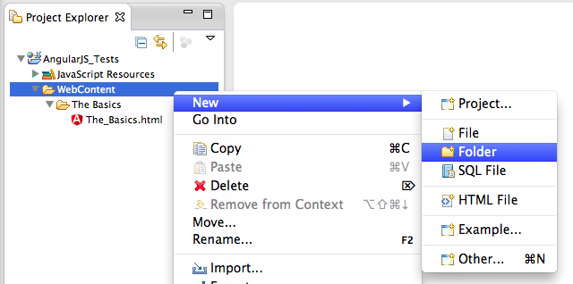](http://3.bp.blogspot.com/-JiJ96Ym4HmM/UwUL9ggWduI/AAAAAAAAG_I/DW_DUIPNxh4/s1600/Screen+Shot+2014-02-19+at+19.12.22.png)
  
... called _Add Some Control_ to the _WebContent _folder of the **_AngularJS_Tests_** project

[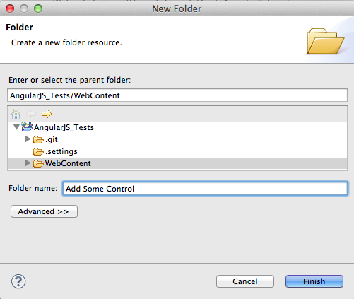](http://2.bp.blogspot.com/-YFkNM01T66A/UwUL9vDGftI/AAAAAAAAG_E/kn1IeSlwwlg/s1600/Screen+Shot+2014-02-19+at+19.13.11.png)
  
And inside it, I created the **index.html**, **_todo.js_** and **_todo.css_** files (each using the Eclipse default template for the respective file type)

[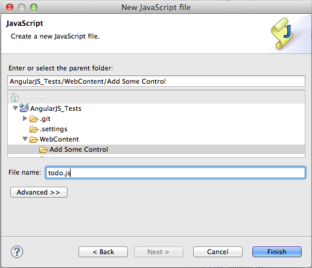](http://3.bp.blogspot.com/-Uuz0la8DzDA/UwUL-ZYwLiI/AAAAAAAAG_c/rvh4lSFysBo/s1600/Screen+Shot+2014-02-19+at+19.14.24.png) [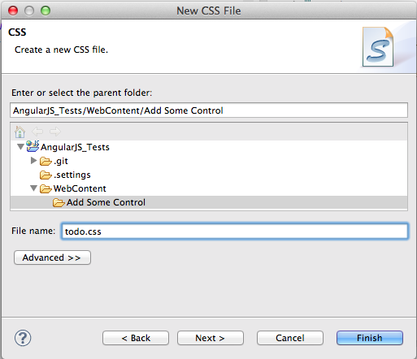](http://2.bp.blogspot.com/-FngzlWPbQtw/UwUL-VBa7yI/AAAAAAAAG_g/cS0oLnhgy8A/s1600/Screen+Shot+2014-02-19+at+19.13.59.png)

Here is what these 3 files look with the default content:

[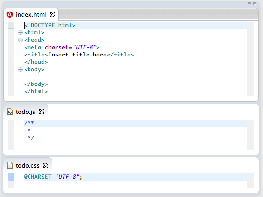](http://4.bp.blogspot.com/-jmuJ-DcW3X4/UwUL_aoRrII/AAAAAAAAHAM/FuIUjeGmf5o/s1600/Screen+Shot+2014-02-19+at+19.15.13.png)
  
Here is what they look like with the content from the [AngularJs.org](http://angularjs.org/) **_Add Some Control _**sample:

[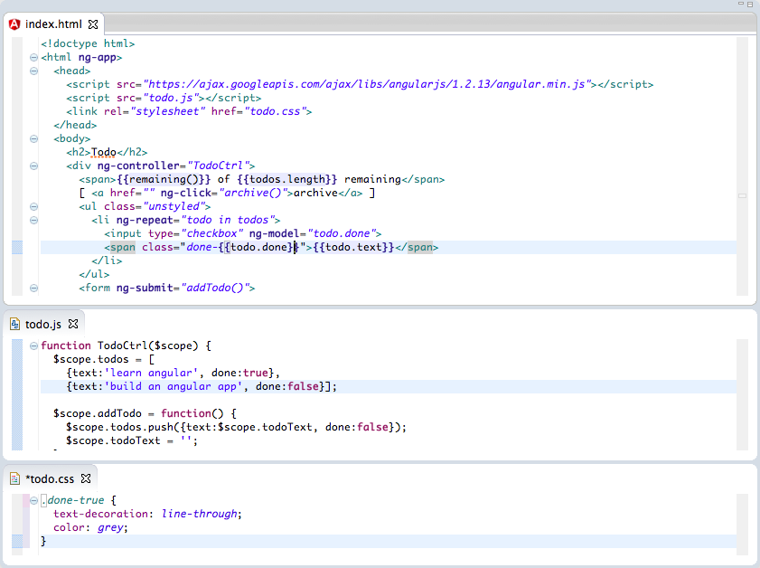](http://2.bp.blogspot.com/-I_xSg062U6s/UwUL_TJ_EAI/AAAAAAAAG_s/fhkEjcXTOuo/s1600/Screen+Shot+2014-02-19+at+19.16.00.png)
  
**2) Opening up in Web Browser**  

To see the example in action, right-click on the **_/Add Some Control/index.html_** file, and chose the **_Web Browser_** option form the **_Open With_** menu

  
... which will look like this:

[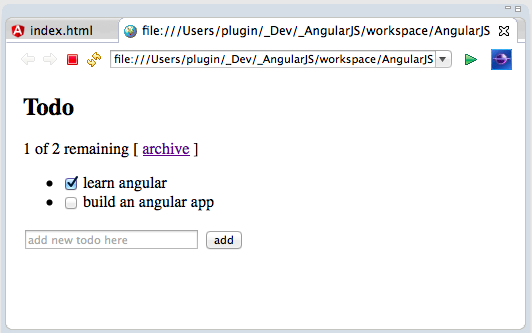](http://3.bp.blogspot.com/-cIi5znC_M8Y/UwUMAI0L3lI/AAAAAAAAHAI/a6lO7lUb0CM/s1600/Screen+Shot+2014-02-19+at+19.17.08.png)
  
The objective of this sample is to add new _Todos _to the list shown, using the TextBox provided and the **_add_** button

[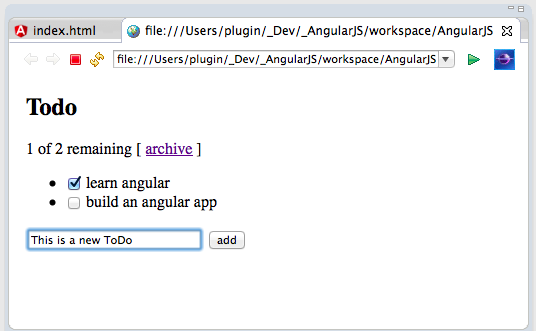](http://2.bp.blogspot.com/-7-B1MRSasB0/UwUMAR8jfSI/AAAAAAAAHAE/7ADOvRzz58I/s1600/Screen+Shot+2014-02-19+at+19.17.23.png)
  
So in the example shown above, after entering _'This is a new ToDo' _on the TextBox and clicking _add_ a new item will be added to the list (see below)

[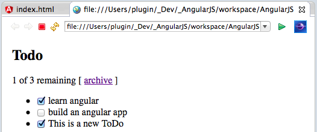](http://2.bp.blogspot.com/-o23m3TJm-iA/UwUMDnZWvdI/AAAAAAAAHBI/FXkI-LCm67w/s1600/Screen+Shot+2014-02-19+at+19.18.03.png)
  
We can also remove **Todos** by using the checkboxes (see above) and clicking on the _**archive**_ link (see below for the result)

  
**2) Making some changes to the code to see AngularJS in $scope in action**

To have a better understanding of what is going on, let's make some changes to the code sample.

Here is the original code

... which I'm going to modify by adding a new paragraph containing the value of the **_todoText_** variable (note that the _todoText _variable is used on the _input _HTML element, auto-wired to Angular by using the **_ng-model_** attribute).

  
After refreshing the browser, we can see this in action by typing some text on the TextBox and seeing it show in real time after the '**New Todo text:' **text (one of the features of AngularJS is to keep all these variables in sync):

[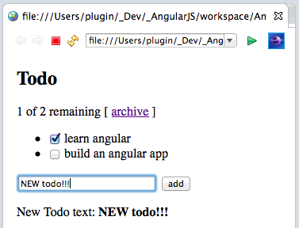](http://2.bp.blogspot.com/-x88AtVziphI/UwUMCQosOkI/AAAAAAAAHAw/zri3O-0gCRY/s1600/Screen+Shot+2014-02-19+at+19.23.10.png)

**3) Changing default ****Todos**

As another test, let's add a new default _todo _to the original version of the **$scope.todos **array (see below).

What is happening is that the**_ $scope.todos_** variable is populated when the _TodoCtrl _is executed (part of the page build), which is then inserted into the webpage using the _<li ng-repeat="todo in todos"> _HTML code (see screenshot of index.html above).

Here is the new **_$scope.todos_** array entry added:

 
... which can be seen in action by refreshing the browser (note that it is already checked by default, since I set the **_done_** variable to **_true_**)

[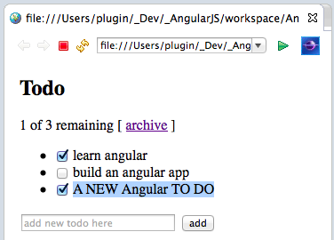](http://2.bp.blogspot.com/-7T6DCKO7KUs/UwUMFqasWcI/AAAAAAAAHBw/SSO1Nso5qe8/s1600/Screen+Shot+2014-02-19+at+19.24.42.png)
  
**4) Changing default value of TextBox (after adding new Todo)**  

To show that we can control the **_$scope_** variables from anywhere in the _TodoCtrl _controller, here is an example where I'm changing the **$scope.todoText **to have a specific value after the **_add_** button is clicked (which is wired to the $scope.addTodo using the **_<form ng-submit="addTodo()">_** HTML code)

After refreshing the web browser, we can see that if we add a new **_todo:_**

  
...  the TextBox (and paragraph below) will have the value _'Default value' _(vs the original behaviour of being empty)

**4) Creating an 'impossible to archive' Todo**  

An interesting variation is to change the default value of the _$scope.todos _on the **_$scode.archive _**method, which, instead of being empty:

  
... it contains one entry:

  
... which means that (after refresh) and clicking on the **_archive_** link  

[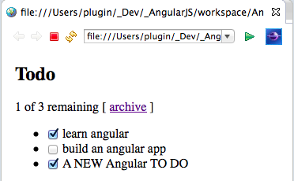](http://2.bp.blogspot.com/-yURBhNShYyk/UwUMFqK-dJI/AAAAAAAAHBs/9EGmX26NSTQ/s1600/Screen+Shot+2014-02-19+at+19.39.05.png)

... the _WILL be added on Archive _todo will now exist:

[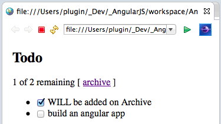](http://2.bp.blogspot.com/-ZfzlxMFFEI4/UwUMGdv-DlI/AAAAAAAAHB4/LyDVTjvB8ZU/s1600/Screen+Shot+2014-02-19+at+19.39.23.png)
  
... and even if we try to archive all:

[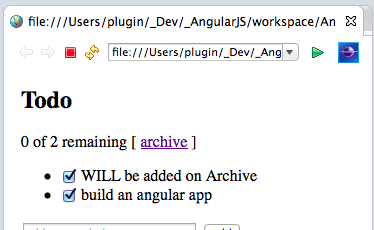](http://1.bp.blogspot.com/-cn1UefwZP_o/UwUMGkqasqI/AAAAAAAAHCA/XlH-yTXyOqU/s1600/Screen+Shot+2014-02-19+at+19.39.30.png)
  
... the _WILL be added on Archive _todo will still be there:

  
**5) Adding a Message label**  
  
As a final example, lets modify change the variable shown in the extra paragraph added to index.html to be _message _(which will be wired to **_$scope.message_**):

[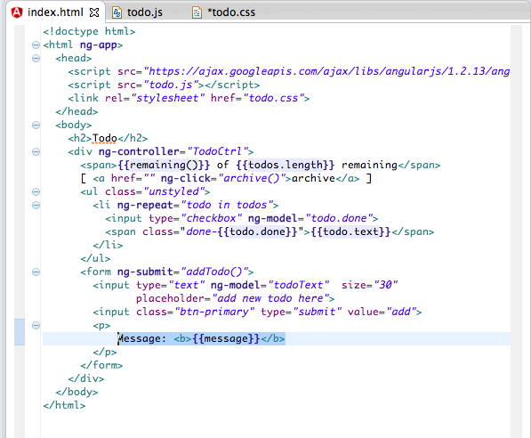](http://4.bp.blogspot.com/-EhmzmcUXHq0/UwUMHf4YHeI/AAAAAAAAHCQ/Ar-X21KVEeg/s1600/Screen+Shot+2014-02-19+at+19.39.56.png)
  
... and lets use that variable to provide visual feedback to the user when the _TodoCtrl_ has executed:

  
Now, we should see the message _'AngularJS controller is all set' _just after the page finishes reloading:

  
To make it more relevant, lets add a _$scope.message _to the _$scope.addTodo _method:

... and the _$scope.archive _method:

  
Now we will get this message when the page reloads:

  
... this message after clicking on the **_add_** button

[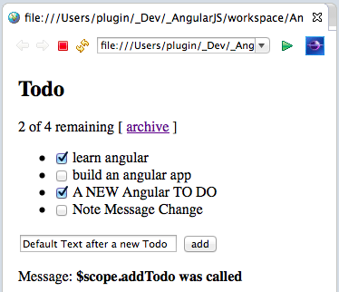](http://4.bp.blogspot.com/-y9cNO8EPkLU/UwUMJgn6NUI/AAAAAAAAHDA/4E1HJEfn98w/s1600/Screen+Shot+2014-02-19+at+19.43.41.png)
  
... this message after clicking on the **_archive link_**

[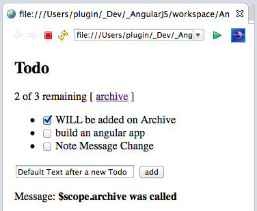](http://2.bp.blogspot.com/-pWwcsxy5bWo/UwUMMSwx3TI/AAAAAAAAHDs/Yvxno_I7qB4/s1600/Screen+Shot+2014-02-19+at+19.43.49.png)

Finally let's refactor the _$scope.addTodo_ method to so that it doesn't add a new **_Todo_** when no value is provided:

  
After reloading the page, we can confirm that trying to click on the **_add_** button without entering first any text on the TextBox will show this message:

  
... and if we add a new one (in this case _'not an empty todo'_) we will see this message:

**Appendix: CSS not being rendered in Eclipse's browser.**  

One thing I noticed was that the style changes provided by **todo.css :**

... was not being shown inside eclipse (as you can see on multiple screenshots above), but worked ok in Chrome:

[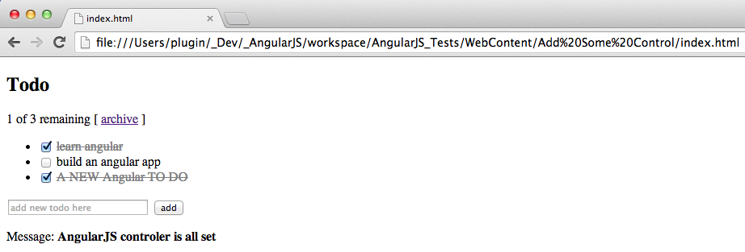](http://2.bp.blogspot.com/-kwSI1Ta5Dy4/UwUMMsmHGhI/AAAAAAAAHD0/ZRTDl9V0DTY/s1600/Screen+Shot+2014-02-19+at+19.49.10.png)
  
... and stand-alone Safari (note that there is a **_line-through_** applied when an item it checked as done)

[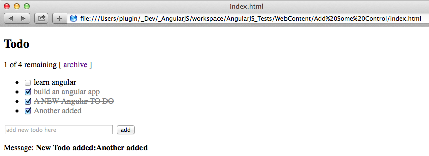](http://1.bp.blogspot.com/-uPKfMucEGz4/UwUMMzQuAII/AAAAAAAAHEE/sQK7pVlCd0A/s1600/Screen+Shot+2014-02-19+at+19.50.59.png)

- - - - 
[Table of Contents](../Table_of_contents.md) | [Code](../Code)