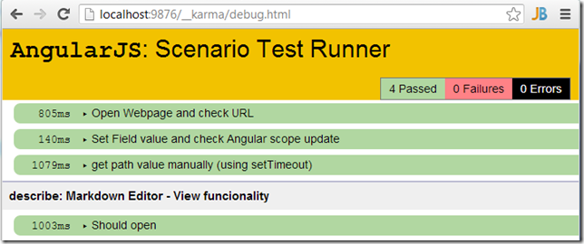
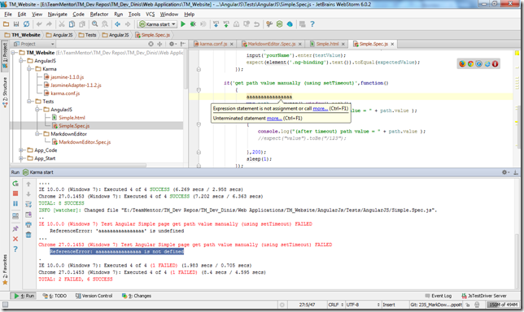
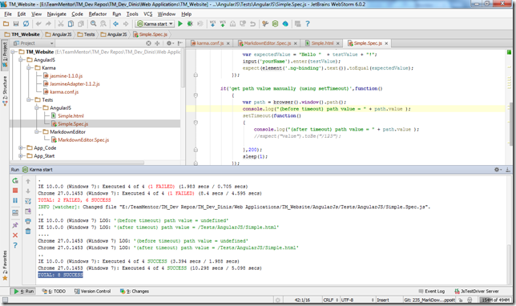
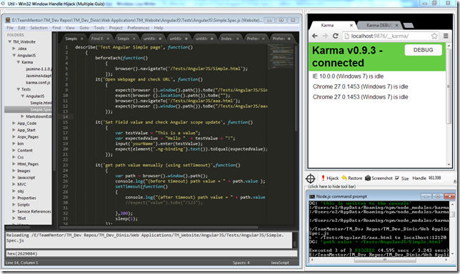

##  Adding KarmaJS support to WebStorm to automagically run tests on file changes (and test UI with SublimeText, Chrome and Cmd.exe) 

On the **_AngularJs_ **and** _KarmaJS_** theme (see [A small AngularJS Jasmine test executed by KarmaJS](http://blog.diniscruz.com/2013/06/a-small-angularjs-jasmine-test-executed.html) and the related posts linked at the bottom), here is my first attempt at using Karma to test AngularJS code inside [TeamMentor](http://teammentor.net/).

I'm using WebStorm instead of VisualStudio, since for Javascript coding [WebStorm](http://www.jetbrains.com/webstorm/) is MUCH better/faster/cleverer, specially since it has good support for AngularJs and Jasmine (with KarmaJS support easily added, as we are about to see).

Also shown below is a cool tool I created that hijacks windows from SublimeText, Chrome and Cmd.exe windows into the same UI (an O2 Platform .NET Script)

Here is the directory structure:  
  

... with **Karma.config.js **looking like this:  

    
    module.exports = function(karma)  
    {  
        karma.configure(
            {  
                frameworks: ['ng-scenario'],
        
                files:  
                            [  
                                '../Tests/**/*.Spec.js'  
                            ],

                urlRoot: '/__karma/',
    
                autoWatch: true,
    
                proxies: {  
                            '/' : 'http://localhost:12120/',  
                            '/Tests': 'http://localhost:12120/AngularJs/Tests/'
    
                     },

               //browsers: ['Chrome'],

                reporters: ['dots'],    //reporters: ['progress'],  
                plugins: [  
                            'karma-ng-scenario',  
                            'karma-chrome-launcher'  
                         //,'karma-firefox-launcher'  
                         ] ,  
              //logLevel: karma.LOG_DEBUG  
                logLevel: karma.LOG_INFO  
            });  
    };  
  
... **Simple.html **like this:  

    
    <!DOCTYPE html>  
    <html xmlns:ng="http://angularjs.org" id="ng-app" ng-app>  
    <head>  
        <meta charset="utf-8">  
        <meta http-equiv="X-UA-Compatible" __content="IE=EmulateIE9" />  
        <title>Simple AngularJS page</title>  
          
    </head>  
    <body>  
    
  
        <label>Name:</label>  
        <input type="text" ng-model="yourName" placeholder="Enter a name here">  
        
  
        <h1>Hello {{yourName}}!</h1>  
    
  
    </body>  
    </html>

  
... **Simple.Spec.js** like this:  

    
    describe('Test Angular Simple page', function()  
        {  
            beforeEach(function()   
                {              
                    browser().navigateTo('/Tests/AngularJS/Simple.html');              
                });  
            it('Open Webpage and check URL', function()  
                {                  
                    expect(browser ().window().path()).toBe("/Tests/AngularJS/Simple.html");  
                    expect(browser ().location().path()).toBe("");  
                    browser().navigateTo('/Tests/AngularJS/aaa.html');  
                    expect(browser ().window().path()).not().toBe("/Tests/AngularJS/Simple.html");  
                    expect(browser ().window().path()).toBe("/Tests/AngularJS/aaa.html");  
                });

            it('Set Field value and check Angular scope update', function()  
                {  
                    var testValue = "This is a value";  
                    var expectedValue = "Hello " + testValue + "!";  
                    input('yourName').enter(testValue);  
                    expect(element('.ng-binding').text()).toEqual(expectedValue);  
                });

            it('get path value manually (using setTimeout)',function()  
                {
                    var path = browser().window().path();  
                    console.log("(before timeout) path value = " + path.value );  
                    setTimeout(function()  
                        {  
                            console.log("(after timeout) path value = " + path.value );  
                            //expect("value").toBe("/123");

                        },200);  
                    sleep(1);  
                });  
        });  
  
... and **MarkDown.Editor.Spec.js** currently with just  
  
    describe('Markdown Editor - View funcionality', function()  
        {  
            it("Should open", function()  
                {  
                    browser().navigateTo('/Markdown/Editor');  
                    expect(browser ().window().path()).toBe("/Markdown/Editor");  
                    expect(browser ().location().path()).toBe("");  
                    //sleep(10);  
                });  
        });
  
This is how I configured Karma to run on WebStorm:

Here is KarmaJS execution log:

Here are two connected KarmaJS Runners (one in IE and one in Chrome)

And finally, here is the (super useful) **_AngularJS: Scenario Test Runner_** view, in a collapsed state:

... and in an expanded state:

  
With this set-up KarmaJS is configured to run continuously and to monitor any file changes, which is really powerful, since it allows for continuous development and testing.

For example (to see the automagically execution in action), here is what the WebStorm UI looks like:

** ... with an Javascript error:** (KarmaJS execution triggered on Save) **:**

**... without the error: ** (KarmaJS execution triggered on Save)

This is a really nice environment to quickly develop AngularJS apps, specially since the tests are super quick to execute and we can control what tests are executed (for example by creating multiple karma.conf.js files)

**O2 Platform Test GUI (created by hijacking 3 processe' windows)**

I also created a test GUI using the [O2 Platform](http://blog.diniscruz.com/p/owasp-o2-platform.html)'s [window-handle Hijack capabilities,](http://blog.diniscruz.com/search/label/WinAPI) which looked like this:

In the image above:  

* The host process is the O2 Platform [Util - Win32 Window Handle Hijack (4x host panels ).h2](http://blog.diniscruz.com/2012/11/util-win32-window-handle-hijack-4x-host.html) script/tool (which is a .Net app)
  
    * The left-hand side the [**Sublime Text** editor](http://www.sublimetext.com/) (which is a C++, Pyhton app)  
    * The top-right is **_Chrome_** (which is C++ app)  
    * The bottom-right is **cmd.exe** (C++ app) running the command _**karma start karma.conf.js **in the **E:\TeamMentor\TM_Dev Repos\TM_Dev_Dinis\Web Applications\TM_Website\AngularJS\Karma** folder_

All in a nice, self-contained process/environment

Note that there are 4 separate process at play here (O2 Platform, Sublime, Chrome and Cmd.Exe w/ Karma)

  
**Related AngularJS and KarmaJS posts:**

  * [A small AngularJS Jasmine test executed by KarmaJS](http://blog.diniscruz.com/2013/06/a-small-angularjs-jasmine-test-executed.html)
  * [KarmaJS AngularJS Scenario Test Runner execution variations in IE 7,8,9 and 10 when using AngularJS](http://blog.diniscruz.com/2013/06/karmajs-angularjs-scenario-test-runner.html) 
  * [Debugging a weird case of missing module in AngularJS and KarmaJS](http://blog.diniscruz.com/2013/06/debugging-weird-case-of-missing-module.html) 
  * [Running KarmaJS's AngularJS example test/e2e/angular-scenario (on Chrome)](http://blog.diniscruz.com/2013/06/running-karmas-angularjs-example.html) 
  * [AngularJS code editor using UI-Bootstrap and CodeMirror (done without using jQuery)](http://blog.diniscruz.com/2013/06/angularjs-code-editor-using-ui.html) 
  * [Hubspot current.js code includes JQuery on it](http://blog.diniscruz.com/2013/04/hubspot-currentjs-code-includes-jquery.html) 
  * [Submitting TM users to HubSpot via TBOT interface (using Angular JS)](http://blog.diniscruz.com/2013/04/submitting-tm-users-to-hubspot-via-tbot.html) 
  * [Using Chrome inside a native VisualStudio pane (using Window Handle Hijacking)](http://blog.diniscruz.com/2013/03/using-chrome-inside-native-visualstudio.html) 
  * [If AngularJS doesn't work on your O2 Platform IE scripts (the fix is to change browser compatibility mode)](http://blog.diniscruz.com/2013/06/if-angularjs-doesnt-work-on-your-o2.html) 

- - - - 
[Table of Contents](../Table_of_contents.md) | [Code](../Code)